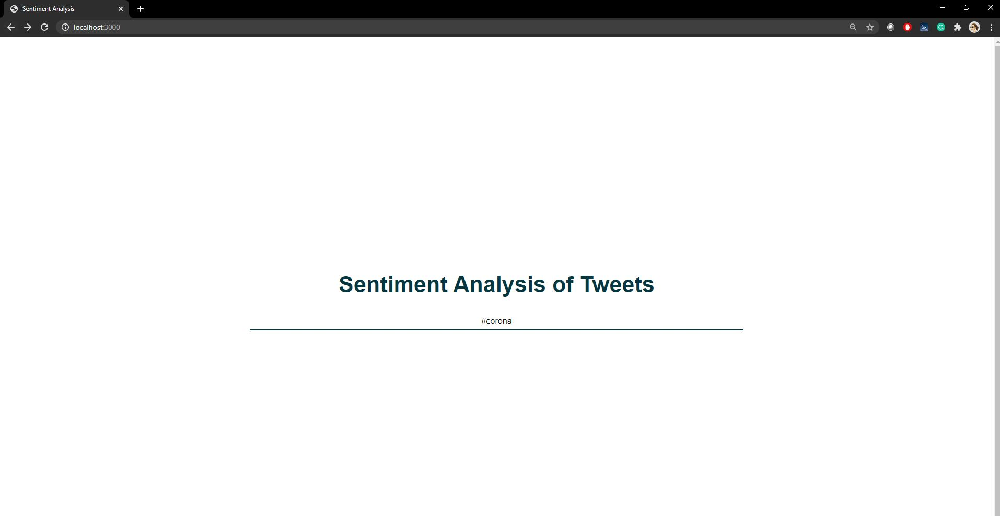

# TwitterSentimentAnalysis
Sentiment Analysis on Tweets for a query in NodeJS
Query can be text or hashtag

 

  
# To Run
1. npm install
2. update config/properties.json for Twitter developer account app details
3. npm start
 http://localhost:3000/

# Steps
1. create developer account using https://developer.twitter.com/en/apps
2. Create app
3. Create node.js app
4. Get query from user
5. Fetch tweets for that query using Twitter library in Node.js
6. Analyze each tweet and find its score using Sentiment library
